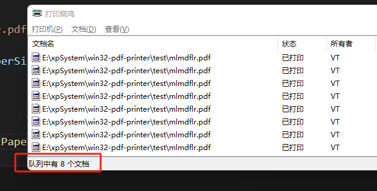

# Node.js & electron print library

A simple and powerful printing library for node and elctron environments.

- Support for getting the paper size supported by the printer
- Support for getting the number of printer queues
- Support to get the printer status
- Small size and strong performance
- Powerful compatibility, the core program can even run on - windows xp
- Works on Windows only
  - Supported OS: Windows 10, Windows 8, Windows 7, Vista.
  - For XP use You just need to download a 3.1.2 SumatraPDF software and specify the path when calling the print api.

## install

```
npm add win32-pdf-printer
```

## use

```TypeScript
import { join } from "node:path";
import {
  print,
  print2,
  getPaperSizeInfoAll,
  getPaperSizeInfo,
  getDefaultPrinter,
  getPrinters
} from "win32-pdf-printer";

// 打印所有打印机支持的纸张大小
console.log(JSON);

// 获取默认打印机支持的纸张大小
console.log(JSON.stringify(getPaperSizeInfoAll()));

// 获取指定打印机支持的纸张大小
// let PrinterPaperSizeInfo = getPaperSizeInfo({ printer: '\\\\192.168.0.126\\HP LaserJet Tank 1020 PCLmS (V3)' });

// 获取默认打印机名称
let DefaultPrinterName = getDefaultPrinter()?.PrinterName

// 获取所有打印机名称信息
let AllPrinterName = getPrinters()

// 打印测试
print(join(__dirname, "mlmdflr.pdf"), {
  printer: DefaultPrinterName,
  paperSize: DefaultPrinterPaperSizeInfo?.PaperSizes[0].PaperName,
});

print2(join(__dirname, "mlmdflr.pdf"),DefaultPrinterName);

```

### out

```json
[
  {
    "PrinterName": "打印烧鸡",
    "TaskNumber": 8,
    "Status": 0,
    "StatusMsg": "准备就绪（Ready）",
    "PaperSizes": [
      {
        "Height": 1169,
        "Kind": 0,
        "PaperName": "Custom(72.0mm * 297.0mm)",
        "RawKind": 256,
        "Width": 283
      },
      {
        "Height": 1169,
        "Kind": 0,
        "PaperName": "72mm * 297mm",
        "RawKind": 257,
        "Width": 283
      },
      {
        "Height": 1654,
        "Kind": 0,
        "PaperName": "72mm * 420mm",
        "RawKind": 258,
        "Width": 283
      },
      {
        "Height": 12898,
        "Kind": 0,
        "PaperName": "72mm * 3276mm",
        "RawKind": 259,
        "Width": 283
      }
    ]
  },
  {
    "PrinterName": "HP LaserJet Tank 1020 PCLmS (V3)",
    "TaskNumber": 9,
    "Status": 4,
    "StatusMsg": "正在删除（Pending Deletion）",
    "PaperSizes": [
      {
        "Height": 1169,
        "Kind": 0,
        "PaperName": "Custom(72.0mm * 297.0mm)",
        "RawKind": 256,
        "Width": 283
      },
      {
        "Height": 1169,
        "Kind": 0,
        "PaperName": "48mm * 297mm",
        "RawKind": 257,
        "Width": 189
      },
      {
        "Height": 1654,
        "Kind": 0,
        "PaperName": "48mm * 420mm",
        "RawKind": 258,
        "Width": 189
      },
      {
        "Height": 12898,
        "Kind": 0,
        "PaperName": "48mm * 3276mm",
        "RawKind": 259,
        "Width": 189
      }
    ]
  },
  {
    "PrinterName": "\\\\192.168.0.126\\HP LaserJet Tank 1020 PCLmS (V3)",
    "TaskNumber": 0,
    "Status": 0,
    "StatusMsg": "准备就绪（Ready）",
    "PaperSizes": [
      {
        "Height": 1169,
        "Kind": 0,
        "PaperName": "Custom(72.0mm * 297.0mm)",
        "RawKind": 256,
        "Width": 283
      },
      {
        "Height": 1169,
        "Kind": 0,
        "PaperName": "72mm * 297mm",
        "RawKind": 257,
        "Width": 283
      },
      {
        "Height": 1654,
        "Kind": 0,
        "PaperName": "72mm * 420mm",
        "RawKind": 258,
        "Width": 283
      },
      {
        "Height": 12898,
        "Kind": 0,
        "PaperName": "72mm * 3276mm",
        "RawKind": 259,
        "Width": 283
      }
    ]
  }
]
```



## License

[MIT](LICENSE)
